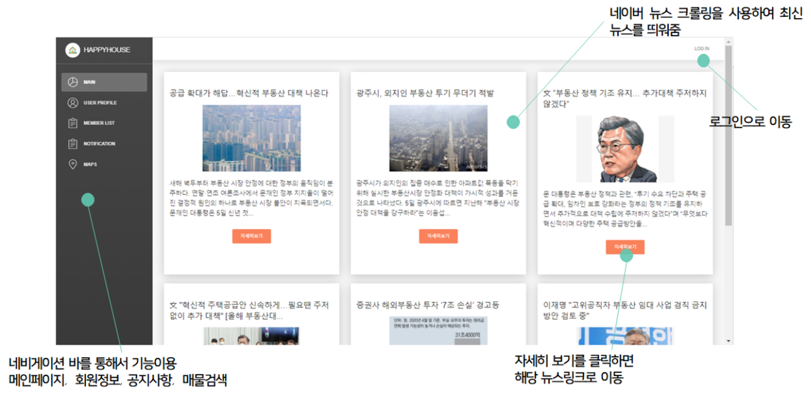
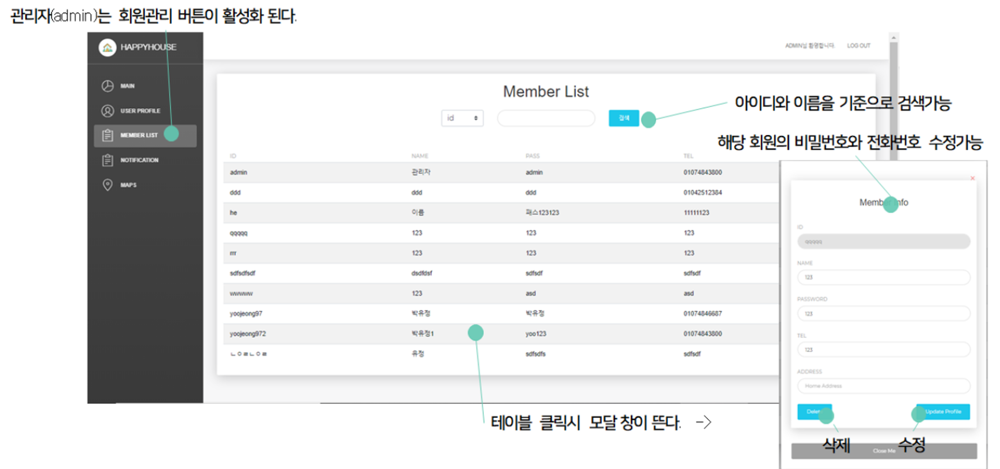
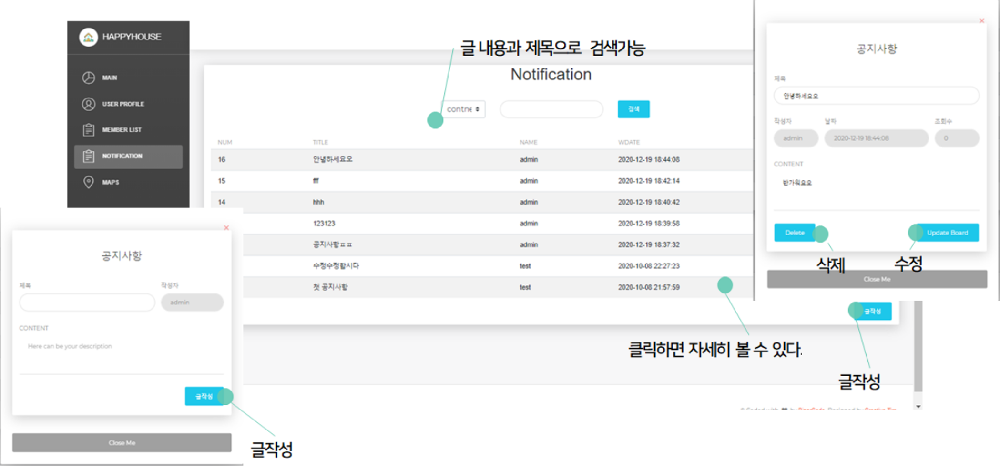

# HappyHouse

#### 프로젝트 소개

* 빠르고 간편하게 부동산 매물을 검색할 수 있다.

* 지도를 이동시키며 매물을 한눈에 볼 수 있고, 거래 시세를 파악할 수 있다.

* 크롤링을 통해 부동산 관련 뉴스를 가져와 매일 부동산 관련 핫이슈를 확인할 수 있다.	

#### 진행기간

2020.11.19~2020.11.27

#### 진행인원

2명

#### 맡은역할

* DB설계
* 회원CRUD
* 최신뉴스 웹 크롤링
* JWT 토큰으 이용한 로그인/로그아웃
* 매물검색
* 공공데이터 API 연동
* 추후 전체 UI 수정

#### 기술스택

Front-End : Vue.js, Vue Bootstrap

Back-End : SpringBoot, MyBatis

DB : MySql

## 페이지 상세 설명

#### 메인페이지

- 부동산 관련 네이버 뉴스 크롤링

#### 매물검색

* 공공 API를 사용하여 매물 정보 불러옴
* 카카오맵 API를 사용하여 매물 위치에 마커와 매물정보를 함께 띄워줌

#### 회원관리

#### 공지사항

